# Flow diagrams

Visual flows for main actions. **More diagrams, less text.**

---

## Create In-App Campaign

What happens when you click **Create Campaign In-App** (CSV + client + options).

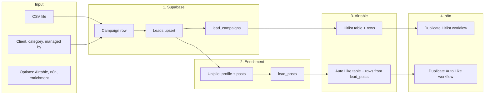

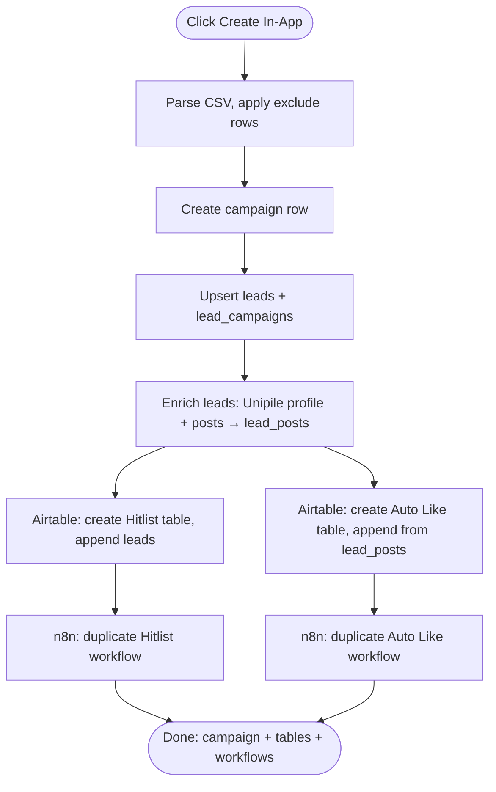

---

## Hitlist automations

As of Mar 11, `runCampaignAutomation` is an **orchestrator** that runs three passes in order: **Invite → Acceptance → Messaging** (the last one only when the per-campaign `messaging_runner` toggle is `in_app`). Errors are classified as **transient** (retry next run, status stays unchanged) or **permanent** (status flips to one of the new terminal states).

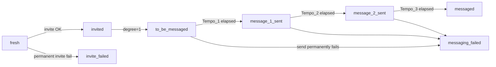

The legacy "all-in-one" flow below is now the **Invite pass only**. The acceptance and messaging passes follow after.

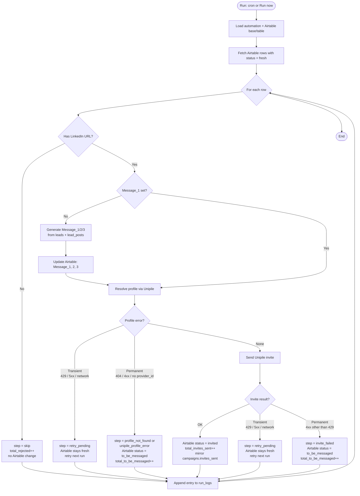

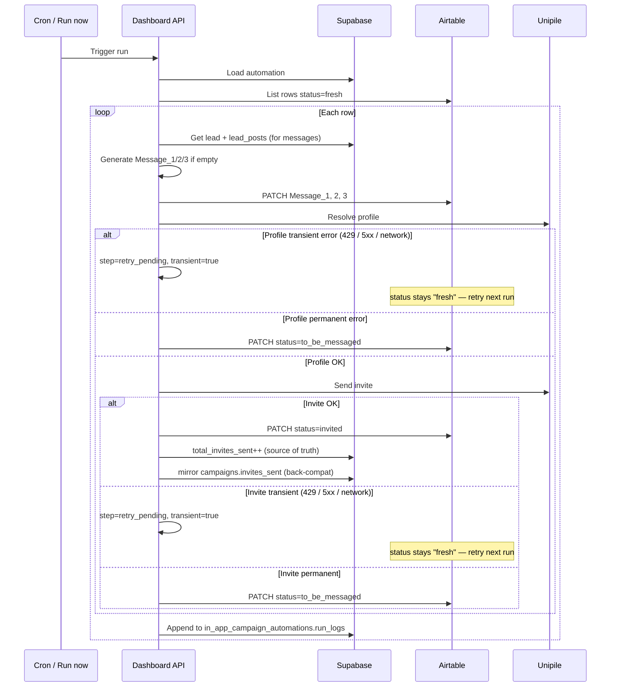

### Acceptance pass (always-on)

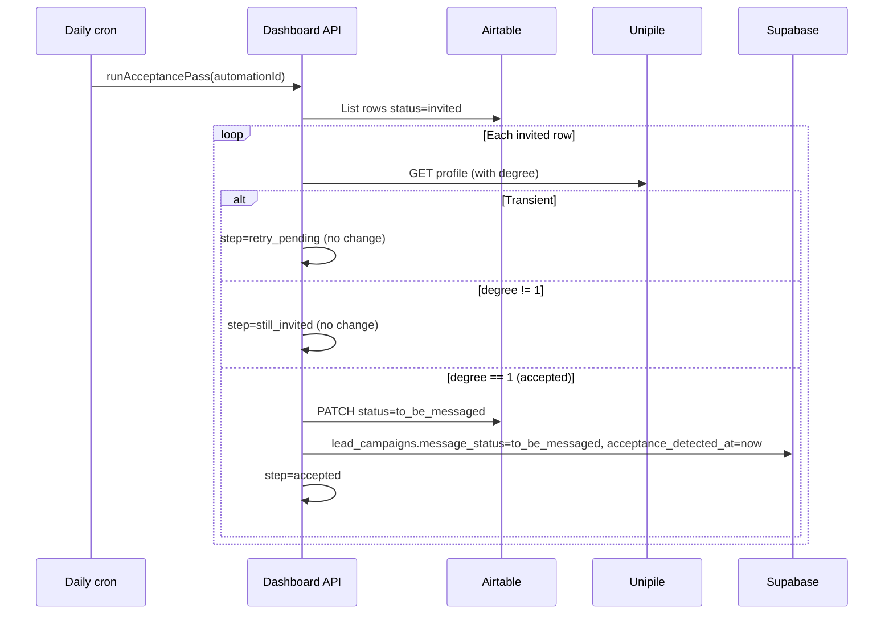

### Messaging pass (toggle: in_app)

```mermaid
sequenceDiagram
  participant Cron as Daily cron / Run messaging now
  participant API as Dashboard API
  participant Airtable
  participant Unipile
  participant Supabase

  Cron->>API: runMessagingPass(automationId)
  Note over API: if messaging_runner != 'in_app' AND !force → return
  API->>API: Reset messages_sent_today if day changed
  API->>Airtable: List rows in {to_be_messaged, message_1_sent, message_2_sent}
  loop Each row (stops at messaging_quota_daily)
    API->>API: nextMessage = M1/M2/M3 based on status
    API->>Supabase: Read baseline timestamp from lead_campaigns
    API->>API: Parse Tempo_X (else default 0/3/3); write back if blank
    alt Not due yet
      API->>API: step=not_due, skip
    else Due
      API->>Unipile: Re-fetch profile (confirm degree=1)
      alt Lead un-accepted
        API->>Airtable: PATCH status=messaging_failed
        API->>Supabase: message_status=messaging_failed
      else OK
        API->>Unipile: POST /api/v1/chats {attendees_ids, text}
        alt Transient
          API->>API: step=retry_pending (no change)
        else Permanent fail
          API->>Airtable: PATCH status=messaging_failed
        else Success
          API->>Airtable: PATCH status=next (message_X_sent or messaged)
          API->>Supabase: message_status=next, message_X_sent_at=now
          API->>API: messages_sent_today++
        end
      end
    end
  end
```

### Airtable in-app button trigger

```mermaid
sequenceDiagram
  participant User
  participant Airtable
  participant API as /api/airtable/trigger
  participant Supabase

  User->>Airtable: Click In_App_Button on a row
  Airtable->>API: GET ?campaign_id=&record_id=&token=
  API->>Supabase: Find automation by campaign_id; verify token
  alt Token mismatch
    API-->>User: HTML 401 page
  else Token OK
    API->>Airtable: GET row to read current status
    alt status=fresh
      API->>API: runInvitePass(recordIds=[id])
    else status=invited
      API->>API: runAcceptancePass(recordIds=[id])
    else status in {to_be_messaged, message_1_sent, message_2_sent}
      API->>API: runMessagingPass(recordIds=[id], force=true)
    else terminal
      API->>API: noop
    end
    API-->>User: HTML confirmation page + link to /campaign-status
  end
```

### KPI bucket mapping (read side)

The KPI dashboard reads `run_logs[].leads[].step` and groups them as follows. The `total_*` counter columns on `in_app_campaign_automations` continue to track cumulatives, but the dashboard's per-bucket counts come from the run log to give an honest split.

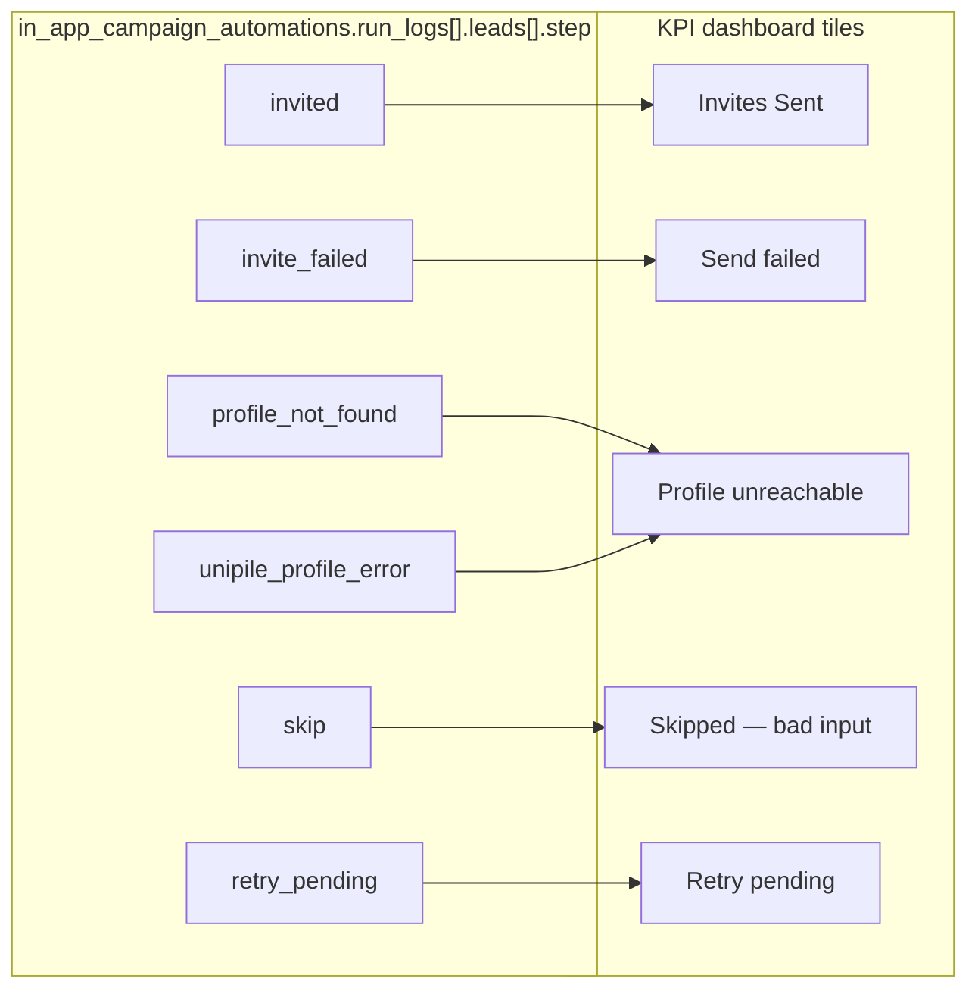

---

## Auto Like / Auto Comment

How the **Auto Like / Auto Comment** table and automation fit together.

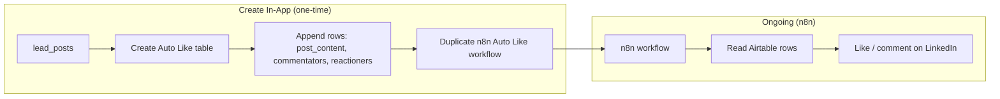

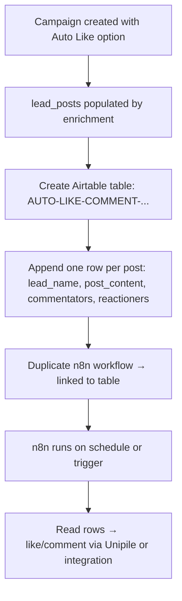

---

## HubSpot sync

What happens when you run **HubSpot sync**.

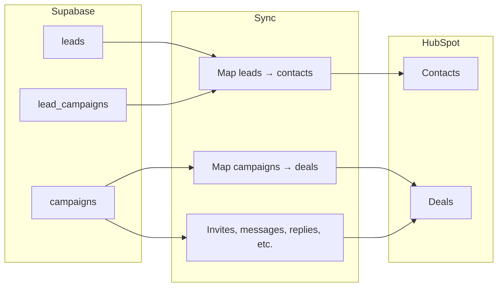

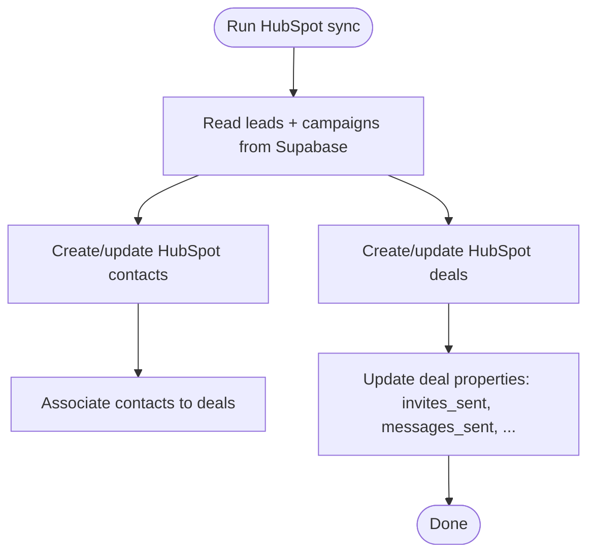

---

## Post Radar

How **Post Radar** gets and uses data.

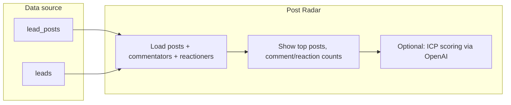

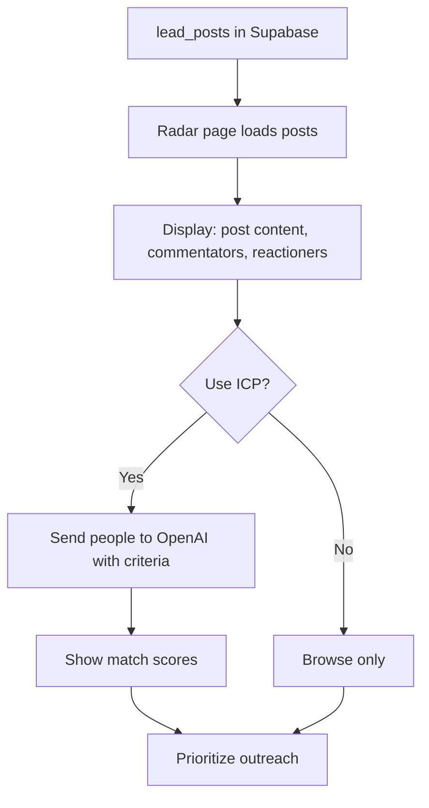
