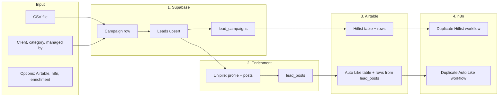
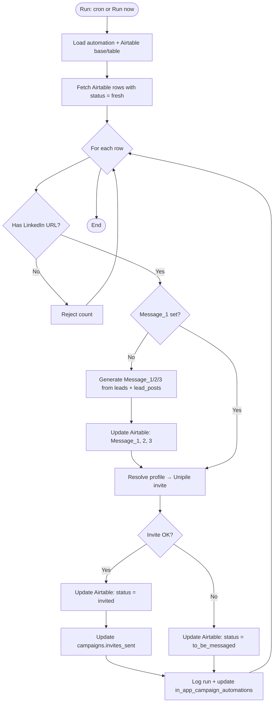
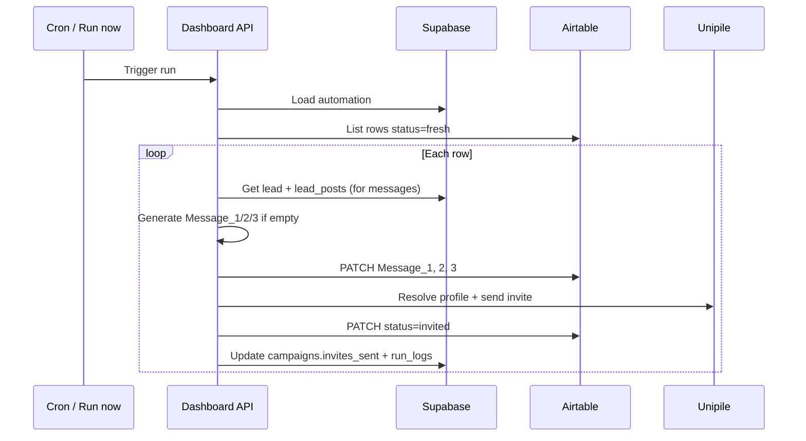
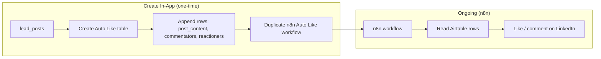
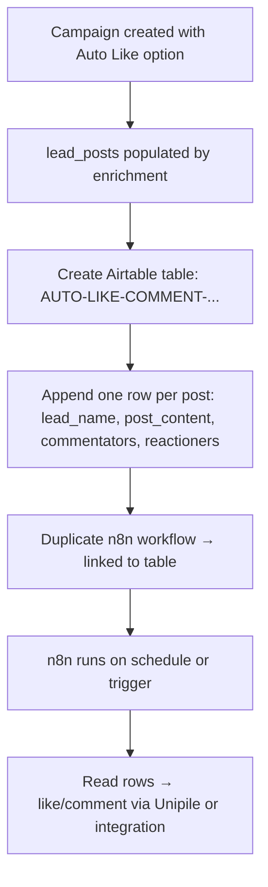
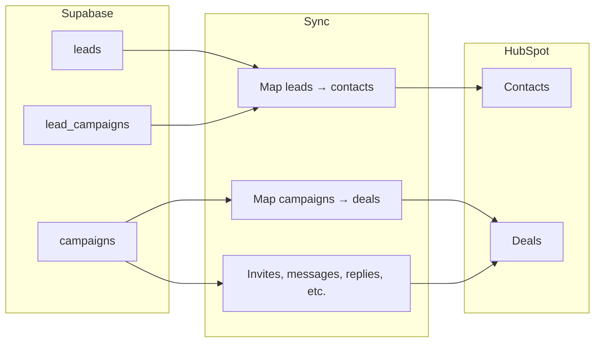
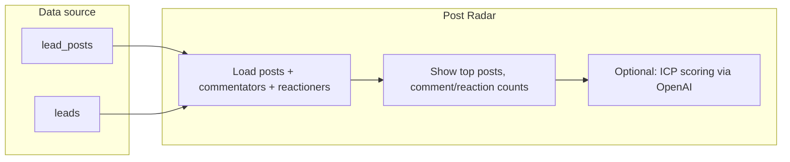
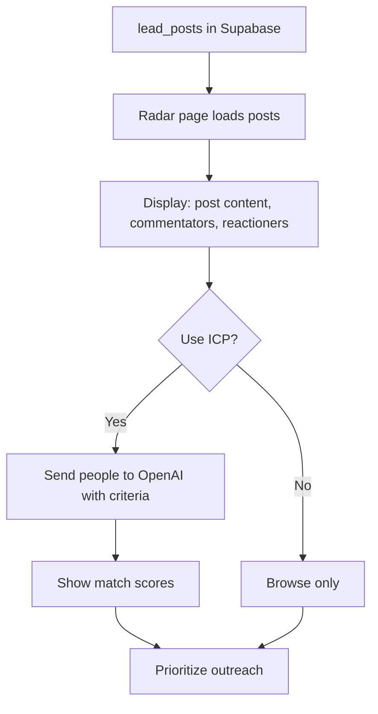

# Flow diagrams

Visual flows for main actions. **More diagrams, less text.**

---

## Create In-App Campaign

What happens when you click **Create Campaign In-App** (CSV + client + options).

---

## Hitlist automations

What happens when a **Hitlist automation** runs (Run now or cron).

---

## Auto Like / Auto Comment

How the **Auto Like / Auto Comment** table and automation fit together.

---

## HubSpot sync

What happens when you run **HubSpot sync**.

---

## Post Radar

How **Post Radar** gets and uses data.

